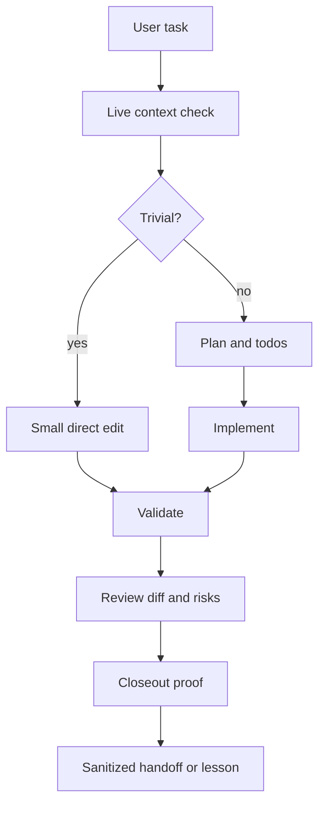

# Harness Architecture

A serious coding-agent harness has a few control surfaces. They do not need to be fancy, but they must be explicit.

## Control surfaces

| Surface | Purpose | Typical artifact |
|---|---|---|
| Session start | load compact current context | active-context note, repo instructions |
| Task planning | prevent thrash and scope drift | todo list, plan, spec |
| Clarification | stress-test unclear work | grill-me prompt |
| Edit discipline | keep changes small and reversible | patch workflow, diff review |
| Validators | prove behavior before closeout | tests, lint, typecheck, build, smoke test |
| Release gate | avoid bad commits and unsafe pushes | status, staged diff, secret scan |
| Session end | preserve continuity | sanitized handoff |
| Patrols | catch drift after work lands | read-only scheduled scans |
| Memory routing | store lessons in the right place | memory, docs, skills, issues |

## Data flow

## Layer rules

- **Instructions** tell the agent how to behave.
- **Skills** encode repeatable procedures.
- **Checklists** make gates visible.
- **Hooks** automate low-risk reminders or read-only scans.
- **Validators** prove behavior.
- **Memory** preserves continuity and reusable lessons.

Do not put secrets, private routes, customer data, or host-specific facts in public harness files.

## Integration levels

### Level 1: Manual

The agent reads prompts and checklists. No automation.

Best for first install or public examples.

### Level 2: Assisted

Session start and closeout reminders are automatic, but commits and pushes remain manual.

Best for individual operators.

### Level 3: Enforced

Pre-commit, CI, scheduled patrols, and release gates block bad paths.

Best for teams, but only after the manual workflow is proven.

## Failure modes

- A hook exists but no agent reads its output.
- A checklist exists but is skipped under time pressure.
- Validators run but do not cover the changed behavior.
- Session memory captures raw private transcripts.
- Patrols mutate repos instead of reporting.
- A "fix" changes provider, auth, git history, or public output without approval.
